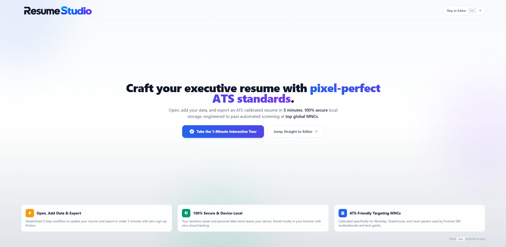
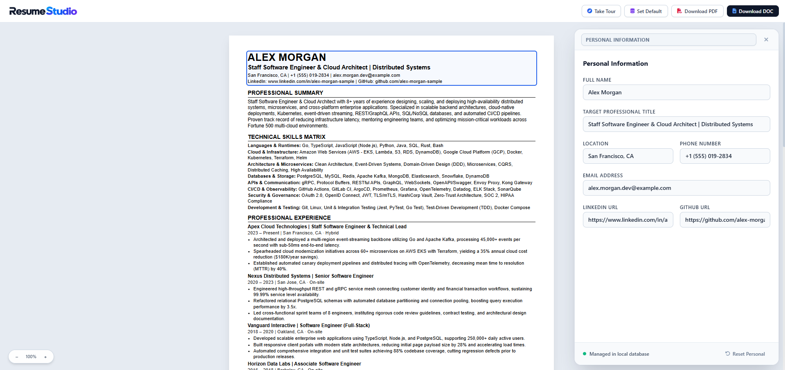

# Resume Studio 📄✨

### ATS-Calibrated Executive Resume Studio & Career Document Engine

---

## 🌐 Live Web Experience

Open, edit, and export your resume in under 5 minutes directly in your browser:

### 👉 **[https://resume-studio-editor.netlify.app/](https://resume-studio-editor.netlify.app/)**

*Zero account registration, zero cloud storage, zero tracking. Your data never leaves your device.*

---

## 🖼️ Studio Showcase

  
  
<em>Studio Onboarding Screen — Streamlined 5-minute update workflow, 100% device-local privacy, and MNC-targeted ATS architecture.</em>

 

  
  
<em>Interactive Dual-Page A4 Studio Canvas — Precision typography, dynamic section editing drawer, real-time page budget meter, and instant export tools.</em>

---

## 🌟 Why Resume Studio?

Most automated resume builders rely on rigid cloud servers, store your confidential career details in remote databases, and generate bloated layouts that fail modern automated hiring algorithms.

**Resume Studio** was engineered from the ground up to solve these problems with three core principles:

1. **Precision ATS Calibration for Top Global MNCs**:
   - Calibrated specifically for Workday, Greenhouse, Lever, Taleo, and iCIMS enterprise screening parsers used by Fortune 500 multinationals and tech leaders.
   - Uses standardized ATS typography (Arial / Helvetica hierarchies, 8.9pt body, 1.28 line height, structured dividers) that parses cleanly without dropped content.

2. **Strict Dual-Page A4 Standard & Flow Budgeting**:
   - Visually simulated print canvas adhering strictly to international A4 dimensions.
   - Dynamic overflow prevention guarantees zero awkward orphan headers, zero accidental blank trailing pages, and seamless flow across pages.

3. **100% Device-Local Privacy (Zero-API Architecture)**:
   - Your sensitive personal and employment data never travels over the internet.
   - All persistence is maintained exclusively inside your browser's private local storage.
   - Document generation runs completely in-browser without third-party servers or external APIs.

---

## ⚡ Key Highlights & Capabilities

- **Interactive WYSIWYG Dual-Page Canvas**:
  - Click any section to open the focused right-side contextual editing drawer.
  - Real-time live synchronization between form inputs and the high-resolution print canvas.
  - Floating precision zoom controls with one-click 100% scale reset.

- **Drag-and-Drop Section Hierarchy**:
  - Reorder entire sections on the fly to highlight what matters most for each job application.
  - Compact list views with drag handles for seamless reordering of experience, projects, skills, and credentials.

- **Dynamic ATS Section Headings**:
  - Tailor section titles directly to match specific job description keywords (e.g. *Executive Profile*, *Technical Skills Matrix*, *Key Projects & Deliverables*).

- **Multi-Format Export Engine**:
  - **100% Vector PDF**: Razor-sharp, vector-rendered print PDF with selectable text, clickable hyperlinks, and exact printer margins.
  - **Microsoft Word (.doc)**: Native Word document export with clean structural headings and bullet points.
  - **Plain Text & Markdown**: Instant one-click plain text and Markdown exports for rapid pasting into ATS application textareas.
  - **JSON Master Model**: Seamless one-click backup and restoration of your entire career data model.

---

## 🤝 Calling All Developers, Designers & ATS Enthusiasts!

**Resume Studio** is an open-source project and community collaboration is warmly encouraged. Whether you have fresh ideas, design proposals, or want to contribute to the codebase, **your input is enthusiastically welcomed!**

### 💡 How You Can Help Shape Resume Studio:
- **Share New Ideas & Feature Requests**: Have an idea for a new section type, layout feature, or ATS optimization? Open an issue on GitHub to kick off the discussion.
- **UI/UX & Design Enhancements**: Help us make the studio interface even smoother, more intuitive, and accessible.
- **ATS Keyword & Parser Research**: Share insights, parser test results, or feedback from modern hiring pipelines to keep our templates ranking at the top.
- **Template & Theme Variations**: Propose new clean, ATS-compliant typographic variations (e.g. Modern Sans vs. Classic Executive Serif).
- **Code Contributions**: Submit pull requests for bug fixes, performance improvements, and frontend enhancements.

### 📬 Get Involved:
- **Submit Ideas & Feedback**: [GitHub Issues Page](https://github.com/bhx20/Resume-Studio/issues)
- **Start a Conversation**: Open a feature suggestion ticket or join repository discussions.
- **Star the Repository**: If you find Resume Studio useful, give it a star on GitHub to help more job seekers discover it!

---

## 📜 Open-Source License

This project is licensed under the **Apache License 2.0**. You are free to use, modify, distribute, and build upon this software according to the terms of the license.

---

  
Crafted with pride for software engineers, tech professionals, and creators worldwide.

  
<strong><a href="https://resume-studio-editor.netlify.app/">Launch Resume Studio Live →</a></strong>

